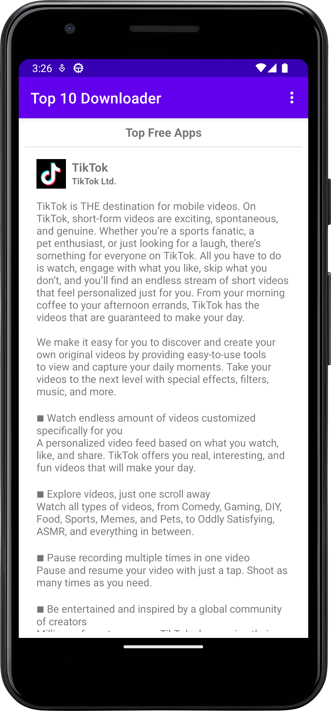
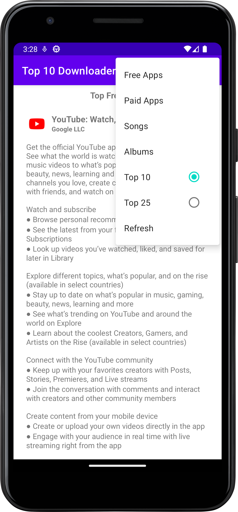
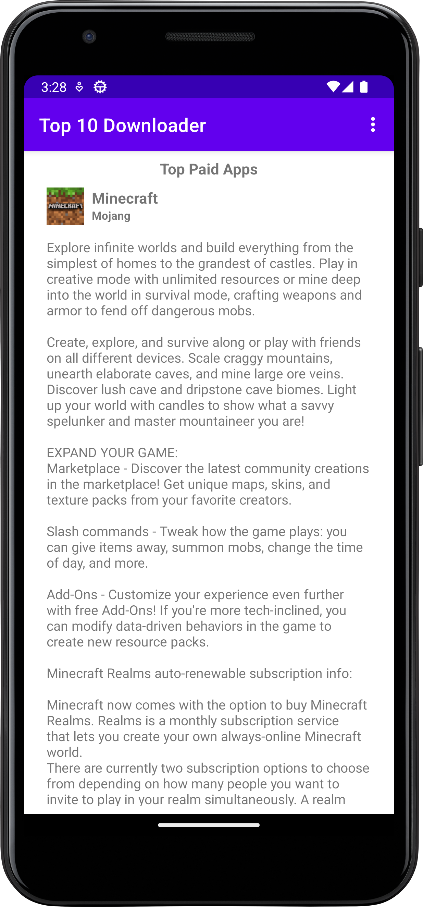
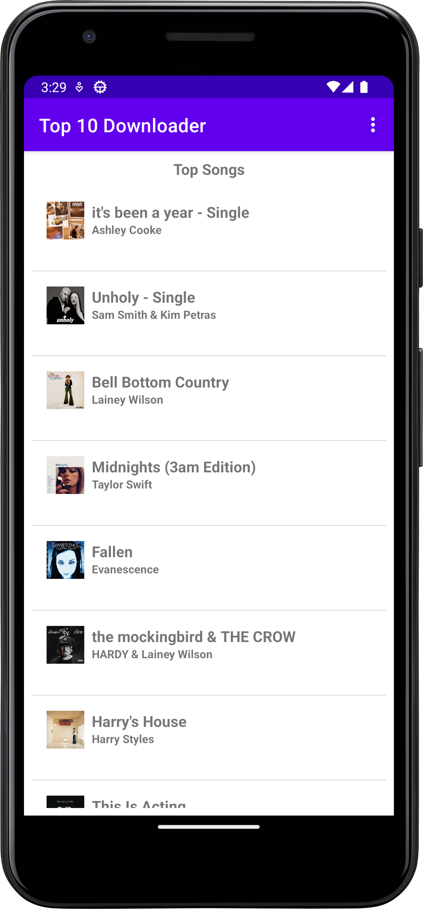
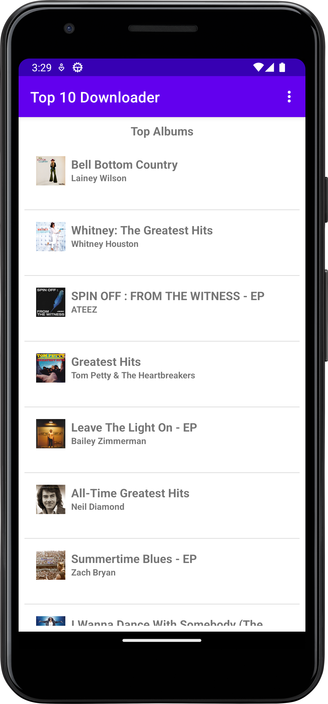

# Top10Downloader
This is an app that basically downloads data from the Apple Really Simple Syndication(RSS) feed and displays the data in a ListView. 
It uses AsyncTask to download data in the background and then parses XML to extract data from the downloaded feed.

**Features**
* Downloads data over the internet using AsyncTask.
* Parses XML to extract data from downloaded feed.
* Displaying extracted data in a ListView.
* A toggle menu to change the number of items displayed in the ListView.
* A list of menu items to change the type of content displayed.

          

          

